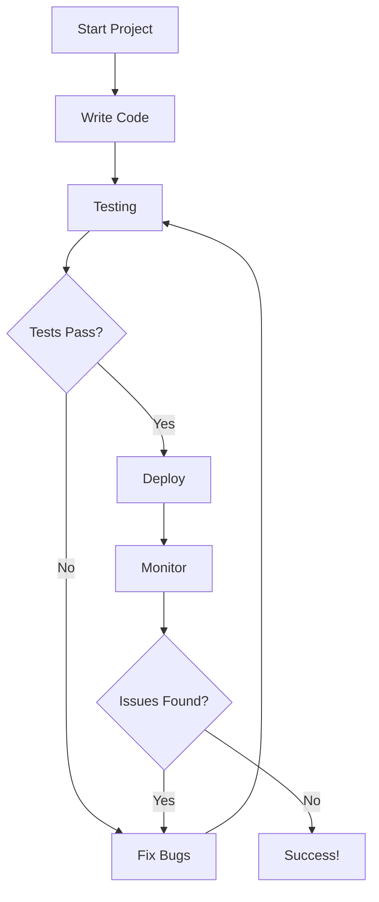
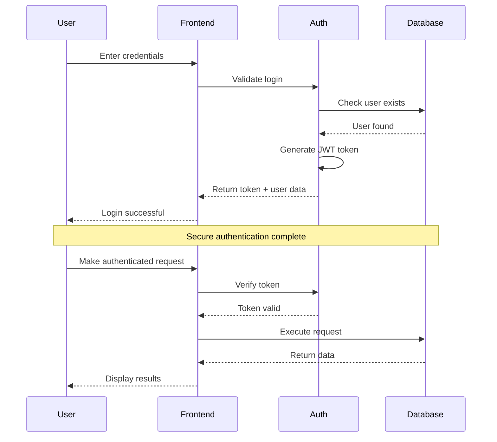
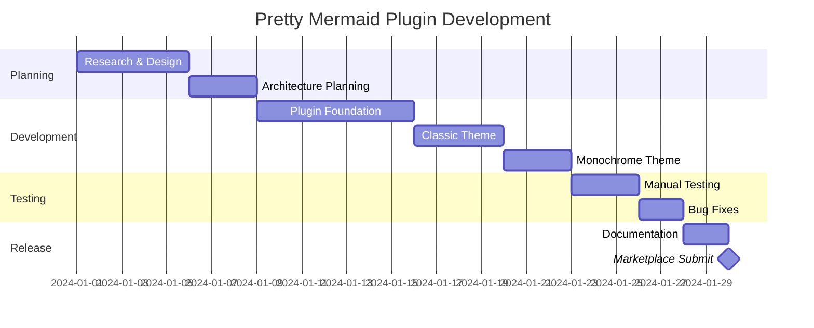
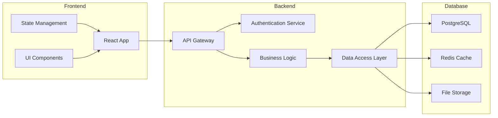
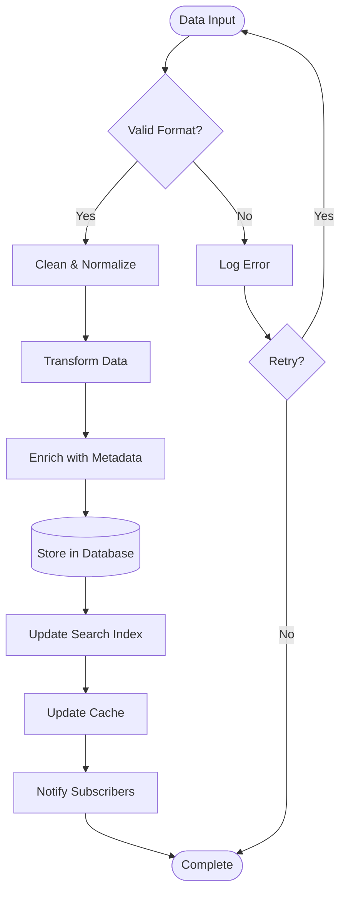
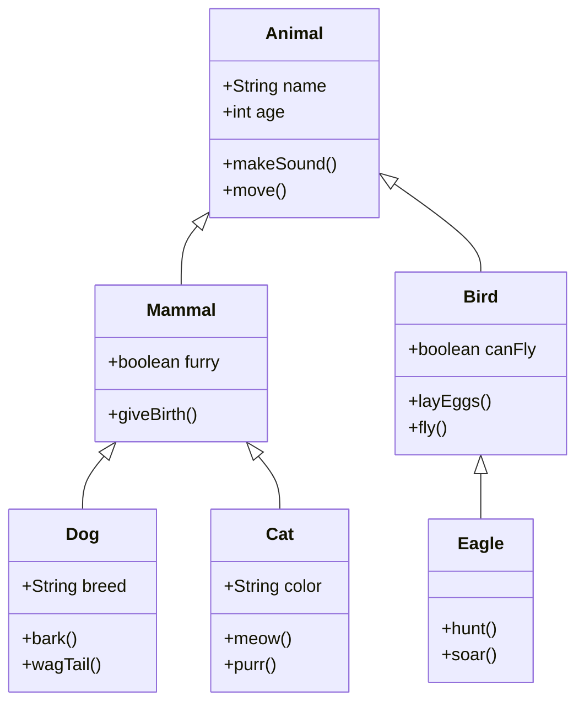

# Pretty Mermaid Plugin Showcase

This page demonstrates the beautiful Mermaid diagrams created by the Pretty Mermaid plugin for Obsidian.

## Classic Theme - Official Mermaid Styling

### Software Development Workflow

### User Authentication Flow

### Project Timeline

## Monochrome Theme - Clean Monochrome

### System Architecture

### Data Processing Pipeline

### Class Hierarchy

## Features Demonstrated

- **Beautiful Colors**: Official Mermaid color schemes with proper contrast
- **Clean Typography**: Trebuchet MS font for authentic look
- **Smooth Borders**: Rounded corners and professional styling
- **Perfect Text Rendering**: No broken or cut-off labels
- **Multiple Diagram Types**: Flowcharts, sequences, Gantt charts, and more
- **Theme Variety**: Classic (colorful) and Monochrome (monochrome) options

> **Try it yourself!** Copy any of these diagram codes into your Obsidian vault and see the Pretty Mermaid plugin transform them into beautiful, professional diagrams.