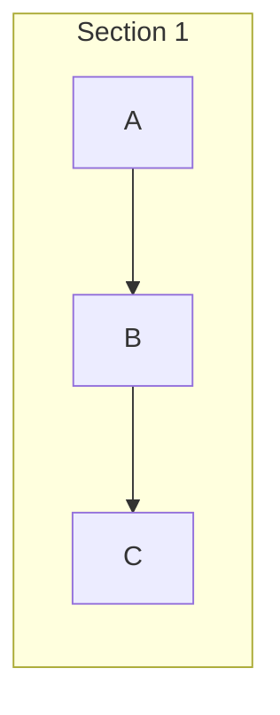

# Development Learnings & Technical Reference

This document summarizes key root causes, edge cases, and design patterns discovered during the development and maintenance of `obsidian-pretty-mermaid`.

---

## 1. Dark Mode Theme Inversion Filter (The "Double-Flip" Effect)

### Root Cause
Obsidian achieves dark mode styling on dynamically rendered Mermaid diagrams by applying a CSS filter (`filter: invert(1) hue-rotate(180deg)`) to SVG blocks. 

### Gotcha
Attempting to fix dark mode text visibility by setting `fill: #ffffff` or `fill: var(--text-normal)` causes the SVG text to be caught in the theme inversion filter and forcefully flipped back to near-black (`#070503`).

### Working Solution
Counter-invert dark mode text by explicitly supplying black (`#000000`) fill in dark mode (so the filter flips it to clean white), while supplying direct dark fill (`#1e293b`) in light mode:

```css
/* --------------------------------------------------------------------------
   DARK MODE — feed #000000 to the inversion filter so it outputs white text
   -------------------------------------------------------------------------- */
body.theme-dark svg[id] .pieTitleText,
body.theme-dark svg[id] .slice,
body.theme-dark svg[id] .legend text,
body.theme-dark svg[id] .messageText,
body.theme-dark svg[id] .loopText,
body.theme-dark svg[id] .labelText,
body.theme-dark svg[id] .sequenceNumber,
body.theme-dark .pretty-mermaid-enhanced .messageText,
body.theme-dark .pretty-mermaid-enhanced .loopText,
body.theme-dark .pretty-mermaid-enhanced .labelText,
body.theme-dark .pretty-mermaid-enhanced .sequenceNumber {
  fill: #000000 !important;
  color: #000000 !important;
}

/* --------------------------------------------------------------------------
   LIGHT MODE — no inversion, provide dark text directly
   -------------------------------------------------------------------------- */
body.theme-light svg[id] .pieTitleText,
body.theme-light svg[id] .slice,
body.theme-light svg[id] .legend text,
body.theme-light svg[id] .messageText,
body.theme-light svg[id] .loopText,
body.theme-light svg[id] .labelText,
body.theme-light svg[id] .sequenceNumber,
body.theme-light .pretty-mermaid-enhanced .messageText,
body.theme-light .pretty-mermaid-enhanced .loopText,
body.theme-light .pretty-mermaid-enhanced .labelText,
body.theme-light .pretty-mermaid-enhanced .sequenceNumber {
  fill: #1e293b !important;
  color: #1e293b !important;
}
```

---

## 2. SVG `<foreignObject>` Clipping on Edge Labels & Nodes

### Root Cause
Mermaid's layout calculation generates fixed `width` and `height` pixel attributes on `<foreignObject>` SVG elements based on unstyled raw text dimensions. When CSS enhances edge labels with background pills, padding (`padding: 3px 10px`), or borders, the element size exceeds the specified bounding box. Default SVG overflow clipping truncates the edges (e.g. clipping "Yes" -> "Ye" and "No" -> "N").

### Working Solution
Enforce `overflow: visible !important` across all `foreignObject` containers and their child wrapper `div`s:

```css
.pretty-mermaid-enhanced foreignObject,
.pretty-mermaid-enhanced .node foreignObject,
.pretty-mermaid-enhanced .edgeLabel foreignObject,
.pretty-mermaid-enhanced .edgeLabel foreignObject > div,
.pretty-mermaid-enhanced .edgeLabel .labelBkg {
  overflow: visible !important;
}
```

---

## 3. Subgraph Layout Orientation (`mermaid.live` vs Obsidian)

### Root Cause
Obsidian core compiles and renders Mermaid SVGs using an embedded renderer before plugin post-processors run. The layout engine (Dagre) calculates graph rank orientation based on offscreen element bounding box aspect ratios:
- In `mermaid.live`, a narrow editor preview pane forces node text to wrap onto 3-4 lines, making nodes tall (`height > width`) and triggering vertical `TD` rank layout.
- In Obsidian, unconstrained text measurement renders single-line wide nodes (`width >> height`), prompting Dagre to auto-orient unconnected subgraphs horizontally (`LR`).

### Working Solution
Always explicitly declare `direction TD` inside each `subgraph` block in the Mermaid code when vertical orientation is desired:



---

## 4. Obsidian Plugin Release Guidelines

1. **Required Release Assets**: Every GitHub release must attach:
   - `main.js` (compiled JavaScript bundle)
   - `manifest.json` (plugin manifest)
   - `styles.css` (custom stylesheet)
2. **Version Matching**: Tag names on GitHub must match the `"version"` string in `manifest.json` exactly (e.g. `2.0.0`).
3. **`versions.json` Mapping**: Maintain `"pluginVersion": "minAppVersion"` mappings in `versions.json`:
   ```json
   {
     "1.0.0": "0.15.0",
     "2.0.0": "0.15.0"
   }
   ```
