# Pretty Mermaid - Comprehensive Theme Testing

This document contains examples of all major Mermaid diagram types to test both Classic and Monochrome themes.

## Flowchart / Graph
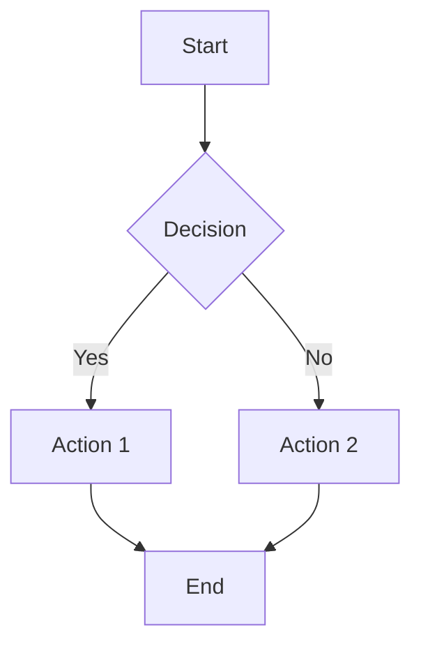

## Subgraph Example
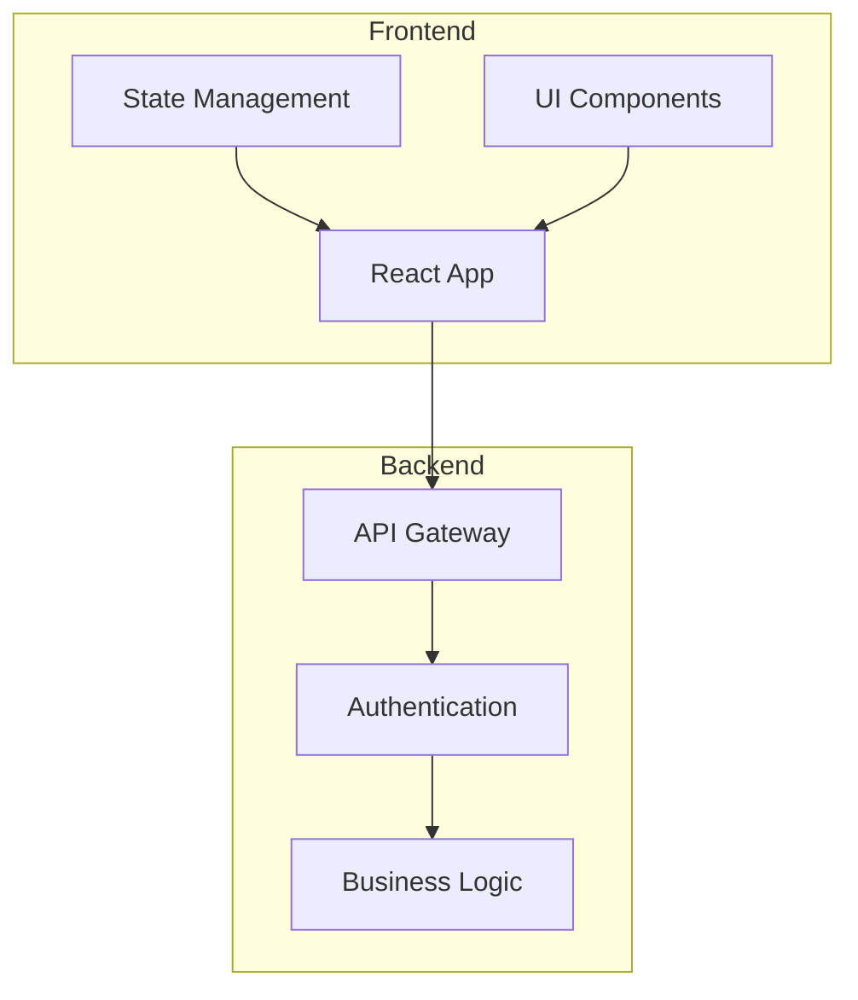

## Flowchart (Modern Syntax)
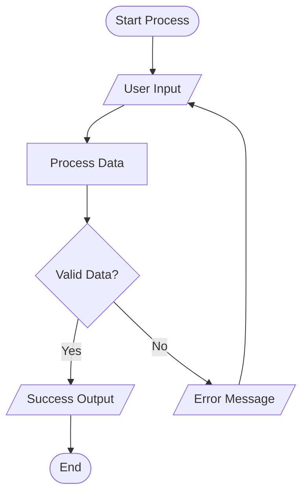

## Sequence Diagram
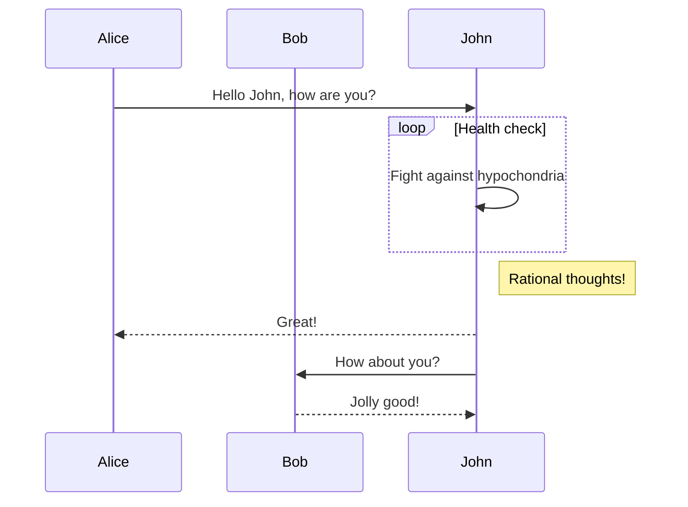

## Class Diagram
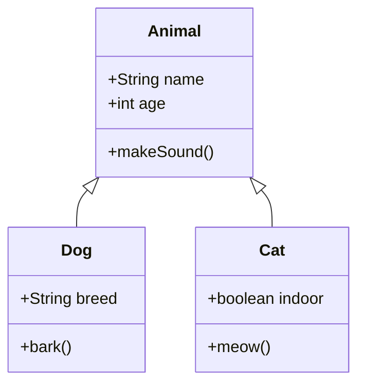

## State Diagram
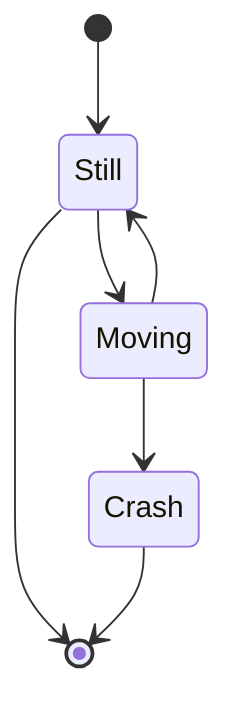

## Gantt Chart
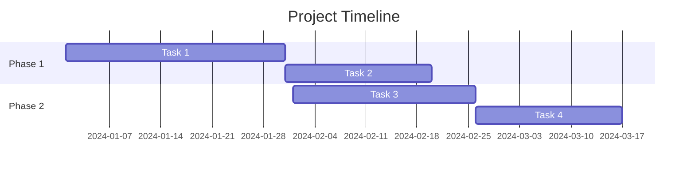

## Pie Chart
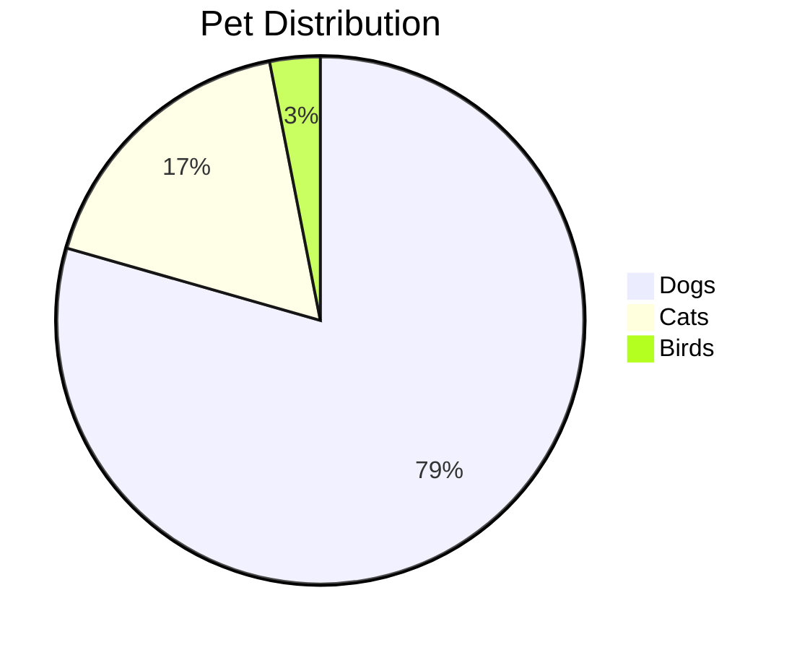

## Entity Relationship Diagram
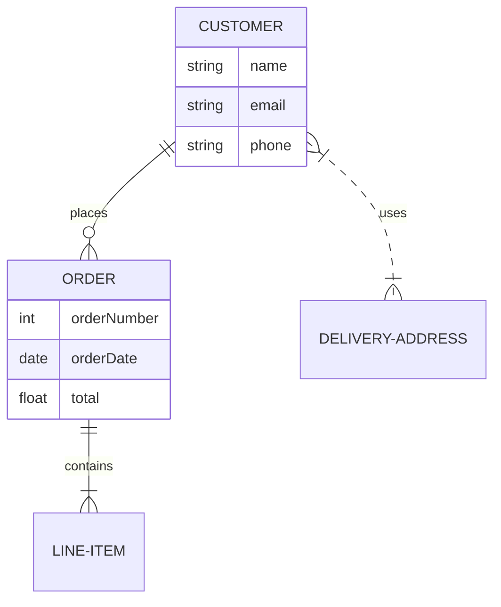

## User Journey
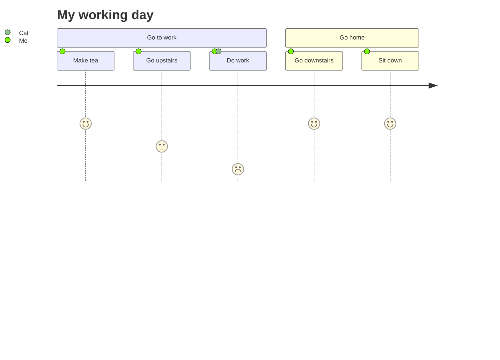

## Git Graph
```mermaid
gitgraph
    commit
    commit
    branch develop
    checkout develop
    commit
    commit
    checkout main
    merge develop
    commit
```

## Requirements Diagram
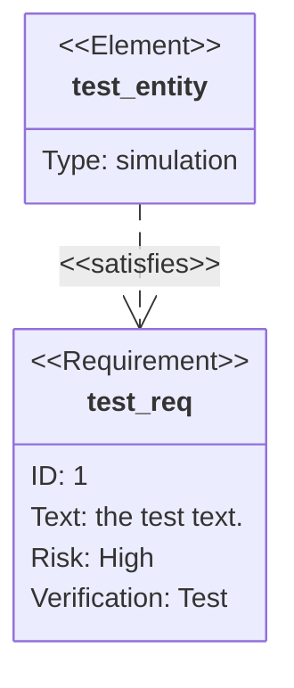