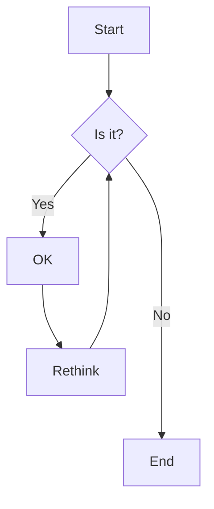
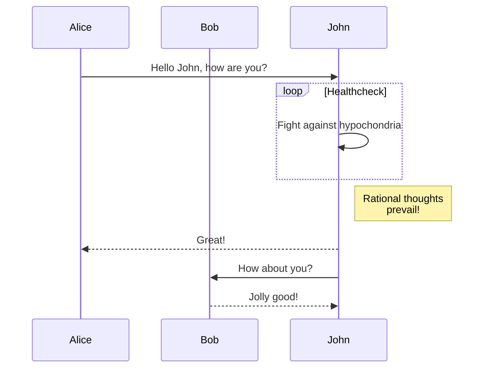
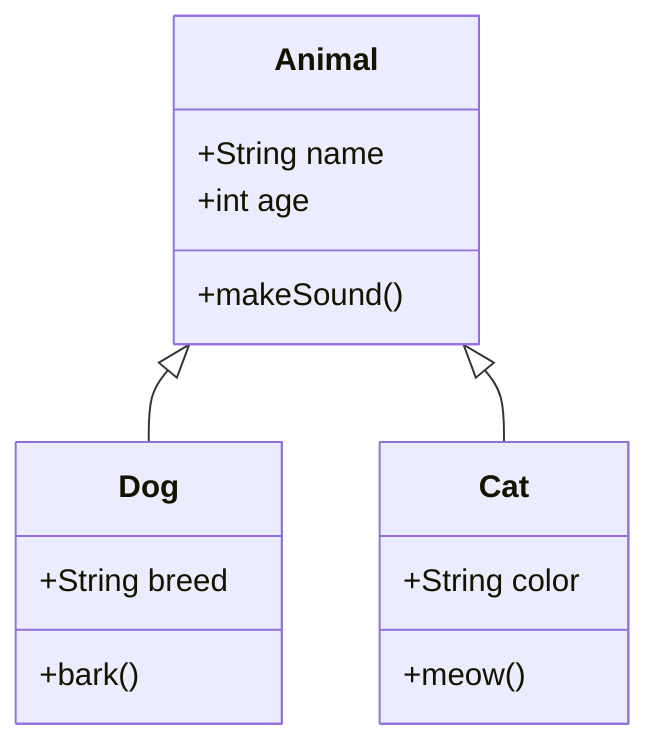
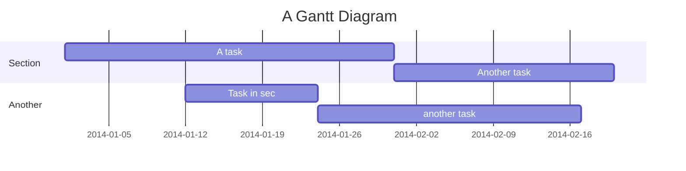
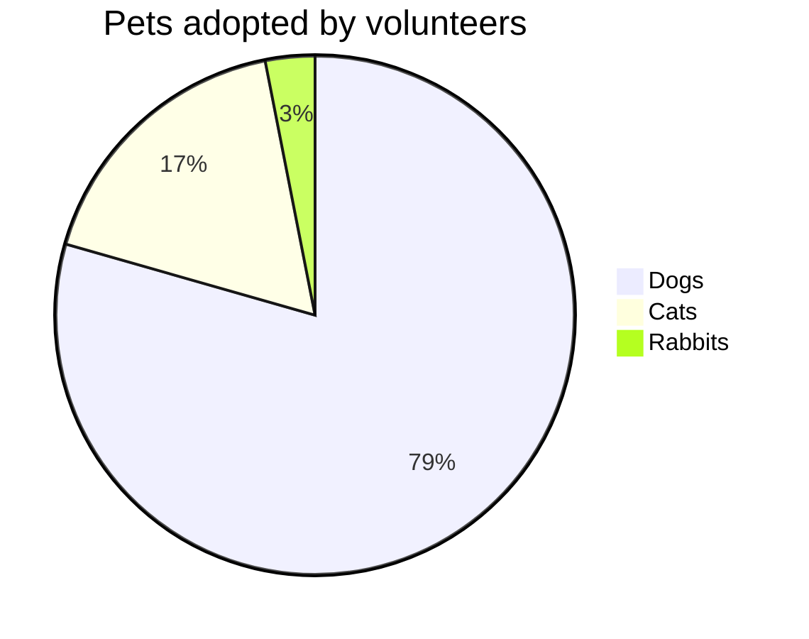

# Sample Mermaid Diagrams for Testing

## Flowchart

```mermaid
graph TD
    A[Start] --> B{Is it?}
    B -->|Yes| C[OK]
    C --> D[Rethink]
    D --> B
    B ---->|No| E[End]
```

## Sequence Diagram

```mermaid
sequenceDiagram
    participant Alice
    participant Bob
    Alice->>John: Hello John, how are you?
    loop Healthcheck
        John->>John: Fight against hypochondria
    end
    Note right of John: Rational thoughts <br/>prevail!
    John-->>Alice: Great!
    John->>Bob: How about you?
    Bob-->>John: Jolly good!
```

## Class Diagram

```mermaid
classDiagram
    class Animal {
        +String name
        +int age
        +makeSound()
    }
    
    class Dog {
        +String breed
        +bark()
    }
    
    class Cat {
        +String color
        +meow()
    }
    
    Animal <|-- Dog
    Animal <|-- Cat
```

## Gantt Chart

```mermaid
gantt
    title A Gantt Diagram
    dateFormat  YYYY-MM-DD
    section Section
    A task           :a1, 2014-01-01, 30d
    Another task     :after a1  , 20d
    section Another
    Task in sec      :2014-01-12  , 12d
    another task      : 24d
```

## Pie Chart

```mermaid
pie title Pets adopted by volunteers
    "Dogs" : 386
    "Cats" : 85
    "Rabbits" : 15
```